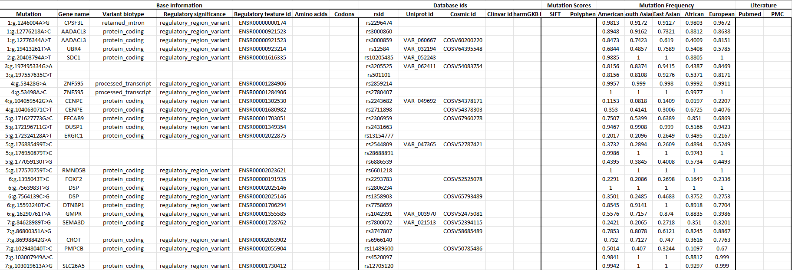

# **Installation**

download and extract the zip folder

cd into the extracted directory and run,

for Linux shell,

```shell
python setup.py sdist bdist_wheel
pip install dist/*whl
```

for Windows command line,

```shell
python setup.py sdist bdist_wheel
for %i in (dist\*.whl) do pip install %i
```

# **Input**
It takes vcf file as input

# **Usage**

```python
from VariantAnnotator import *

ParseObj = Parser("yourVCFfile.txt")
variants = ParseObj.parseInput()
ANNOTATE(variants, output="myOutputFile.xlsx")
```

# **Output**

It pulls following annotations for each variant within the vcf file


### ***Base Annotations***
 
1. Gene name
2. Variant biotype	
3. Regulatory significance: Checks if the variant is within the regu;atory regions of the gene	
4. Regulatory feature id: ENSEMBL regulatory feature id	
5. Amino acids: Reports associated amino acid mutation	
6. Codons: Reports associated codon mutation

### ***Database Ids***  
7. rsid: variant dbSNP database id	
8. Uniprot id: Variant Uniprot database id	
9. Cosmic id: Variant Cosmic database id	
10. Clinvar id: Variant Clinvar database id	
11. PharmGKB ID: Variant PharmGKB database id

### ***Amino acid mutation scores***     
12. SIFT: SIFT scare for the amino acid mutation
13. Polyphen: Polyphen score for amino acid mutation

### ***Mutation frequency***   
14. American: Frequency of the variant in American population	
15. South Asian: Frequency of the variant in South Asian population	
16. East Asian: Frequency of the variant in East Asian population	
17. African: Frequency of the variant in African population	
18. European: Frequency of the variant in African population	
19. Pubmed: Pubmed id for the corresponding variant

Below is the example output excel sheet image




# **Things to do**
1. Error handelling
2. Add protein data
